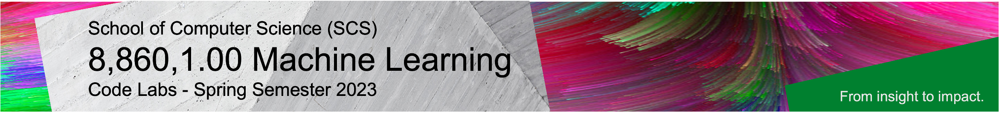

<!--  -->

Welcome to our 8,860,1.00 elective course **Machine Learning**, taught by **Prof. Dr. Damian Borth**. 

Lectures and hands-on lab courses alternate to provide a better learning experience in this course. The lab course materials for Python programming, Machine Learning, and Deep Learning are available and accessible through this repository.

The the lab content is based on [Python](https://www.python.org), [Jupyter Notebook](https://jupyter.org), and [PyTorch](https://pytorch.org). The lab notebooks are developed and maintained by the course TA's [Konstantin Schürholt](https://www.alexandria.unisg.ch/entities/person/Konstantin_Schuerholt/publications), Leo Meynent.

Happy Coding!

# TODO: UPDATE DATES / LINKS

## Course Logistics

- **Lectures:** Mondays 2:15-3:45PM CET, Zoom links are posted on Canvas.
- **Labs:** Mondays 4:15-5:45PM CET, Zoom links are posted on Canvas.
- **Labs Office Hours:** Tuesday 2:00-3:00PM CET, please send us a corresponding invitation via mail.
- **Announcements:** All course-related announcements and questions will happen on Canvas.

## Course Code Lab Notebooks 

This table lists all lab session and coding challenge session incl. the launchers of the corresponding notebooks. In order to start the notebooks in the respective cloud environment just click on the to corresponding launchers. We aim to upload each lab notebook the day before the lab respectively.

| Date                    | Lab        |  Content                         |  CoLab Notebook Launchers                 | MyBinder Notebook Launchers| 
|:-----------------------:|:--------------:|:---------------------------------|:-------------------------------:|:-------:|
| Mon, Feb. 20            |   **Lab 1**     | Lab 101 (Jupyter Notebook)         |  | |
| Mon, Feb. 20            |   **Lab 1**     | Lab 102 (Python Basis)         |  | |
| Mon, Feb. 20            |   **Lab 1**     | Lab 103 (Numpy, Pillow and Matplotlib)         |  | |
| Mon, Feb. 27            | **Lab 2**       | Support Vector Machines & Iris          |  | |
| Mon, Mar. 06            | **CC  1**       | Coding Challenge - Kick-Off & EuroSAT       |  |  |
| Mon, Mar. 13            | **Lab 3**   | Introduction to PyTorch         |  |  |
| Mon, Mar. 13            | **Lab 3**   | Multi-Layer Perceptron      |  |  |
| Mon, Mar. 20            | **Lab 4**   | Custom Datasets in PyTorch    |  |  |
| Mon, Mar. 20            | **Lab 4**   | Convolutional Neural Networks (CNNs) & CIFAR10     |  |  |
| Mon, Mar. 27            | **Lab 5**   | Recurrent Neural Networks (RNNs + LSTMs) - Text Generation        |  |  |
| Mon, Mar. 27            | **Lab 5**   | LSTMs - Stock Price Prediction       |   |  |
| -                       | -       | Semester Break - Happy Easter!                          | -   | -   |
| Mon, Apr. 17            | **CC  2**   | Status Meeting (How's it going so far?)          | - | - |
| Mon, Apr. 24            | **Lab 6**   | Attention               |  |   |
| Mon, May. 01            | **Lab 7**   | K-Means, EM Clustering & Iris               |  |  |
| Mon, May. 08            | **Lab 8**   | Autoencoder (Anomaly Detection on tabular data)  |  |  |
| Mon, May. 15            | **Lab 9**   | Transfer Learning & Self-Supervised Learning        |  |  |
| Mon, May. 22            | **CC  3**   | Coding Challenge (Final Session)                             | - | - |

## How To Run the Course Code Lab Notebooks

#### Option 1: Binder Cloud Environment ()

This is probably the easiest way to run a Notebook in your web browser: just click on the binder badge next to 
the Notebooks below, and off you go. Binder is a service that lets you run Jupyter Notebooks in their cloud at no charge. 
There is no registration and no login required. However, keep in mind that you cannot save any data or your Notebook file in the cloud (you can save them
on your computer, though). Also, starting a binder
Notebook can take quite some time, but the performance during runtime is good. 
For more information, please refer to the [Binder documentation](https://mybinder.readthedocs.io/en/latest/index.html).

#### Option 2: Google Colab Environment ()

Similar to binder, you just have to click the Colab badge next to the Notebooks below. All you need is a Google login
(e.g., your login information for gmail) and you can use this service at no charge. 
Two advantages of Colab are that (1) you can save your 
Notebooks directly into your Google Drive and read data from there, and (2) Google provides you with some limited GPU capabilities
free of charge (this will be an interesting feature for the coding challenge.)

#### Option 3: Local Python Installation (, )

If you prefer to run Notebooks locally on your computer, you will need to install Python. If you choose to do so,
we recommend to install [Anaconda Python](https://www.anaconda.com/products/individual), a package that combines the 
latest version of Python with the most common supplemental modules for data science and machine learning, as well 
as a Jupyter Notebook server that runs on your computer locally. Anaconda 
[installers](https://www.anaconda.com/products/individual#Downloads) are available 
for the most common operating systems, as well as some 
[detailed installation guides](https://docs.anaconda.com/anaconda/install/). 

If you need help running Python and/or Jupyter Notebooks, please don't hesitate to contact us (see below)!

## Questions?

Please use the Canvas forum for course related questions. For external enquiries, emergencies, or personal matters that you don't wish to put in a forum post, you can email us via: `aiml (minus) teaching ( dot ) ics ( at ) unisg ( dot ) ch`.

